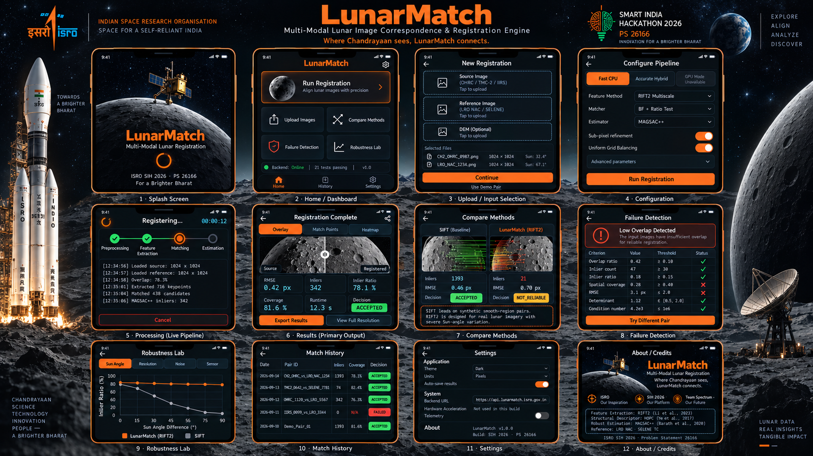
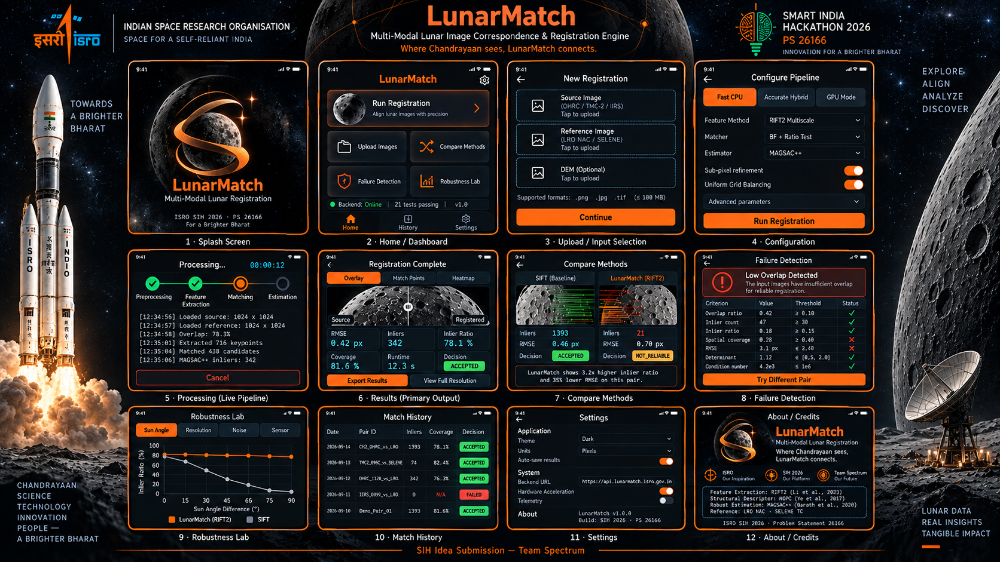

<div align="center">
  
  
  # LunarMatch
  
  **Multi-Modal Lunar Image Correspondence & Registration Engine**
  
  *Where Chandrayaan sees, LunarMatch connects.*
  
  [](https://sih.gov.in)
  [](https://sih.gov.in)
  [](https://spectrum-gules.vercel.app/)
  
  
</div>

---

## Overview

LunarMatch is a cross-modal image registration engine for Chandrayaan-2 orbital
imagery. It aligns OHRC, TMC-2, and IIRS images against lunar reference data
(LRO NAC, SELENE) across differing Sun angles, resolutions, and sensor modalities.

The pipeline is fully CPU-based, offline-capable, and runs on standard hardware.
Every registration emits measured quality metrics and an explicit success or
failure decision.

## Capabilities

- **Illumination-invariant feature extraction** via RIFT2 phase congruency and HOPC structural descriptors
- **Multi-scale pyramid** built on phase-congruency maps for cross-resolution matching
- **MAGSAC++** threshold-free robust estimation
- **Sub-pixel phase-correlation refinement** for precise localization
- **Sensor-pair adaptive routing** (OHRC / TMC-2 / IIRS / LRO NAC / SELENE)
- **Uniform Spatial Grid Balancing** for distributed match coverage
- **Automatic failure detection** with per-criterion acceptance checks

## Quick Start

### Backend

```bash
cd backend
pip install -r requirements.txt
uvicorn app.main:app --host 0.0.0.0 --port 8000
```

API documentation is available at `http://127.0.0.1:8000/docs`.

### Frontend

```bash
cd mobile
flutter pub get
flutter run -d windows       # or: flutter run -d chrome
flutter build apk --release  # produces app-release.apk
```

The APK is available at `mobile/build/app/outputs/flutter-apk/app-release.apk`.

## Technology Stack

| Layer | Technology |
| :--- | :--- |
| Backend | Python 3.11, FastAPI, OpenCV 4.13, NumPy, SciPy |
| Frontend | Flutter 3.41, Provider |
| Algorithms | RIFT2, HOPC, MAGSAC++, Phase Correlation |
| Tests | Pytest (isolated runner), Flutter Test |

## Project Structure

```
backend/       FastAPI service, computer-vision pipeline, tests
mobile/        Flutter application, 12 screens
docs/          Visual assets, UI mockup, logo
```

## Testing

```bash
cd backend
python run_tests_isolated.py   # 21 test files

cd ../mobile
flutter test                    # 32 widget tests
```

## Application Interface


*LunarMatch's mission-control interface. Upload Chandrayaan-2 imagery, configure
the pipeline, monitor registration, and inspect results — all within a single app.*

## Attribution

LunarMatch builds on the following published work:

- RIFT2 — Li, Hu, Ai (IEEE TIP 2020 / arXiv 2023)
- HOPC — Ye et al. (IEEE TGRS 2017)
- MAGSAC++ — Barath et al. (CVPR 2020)

## Team

Team Spectrum — Smart India Hackathon 2026
Problem Statement 26166 — Space Technology
Department of Space / ISRO

## License

Developed for ISRO Smart India Hackathon 2026.