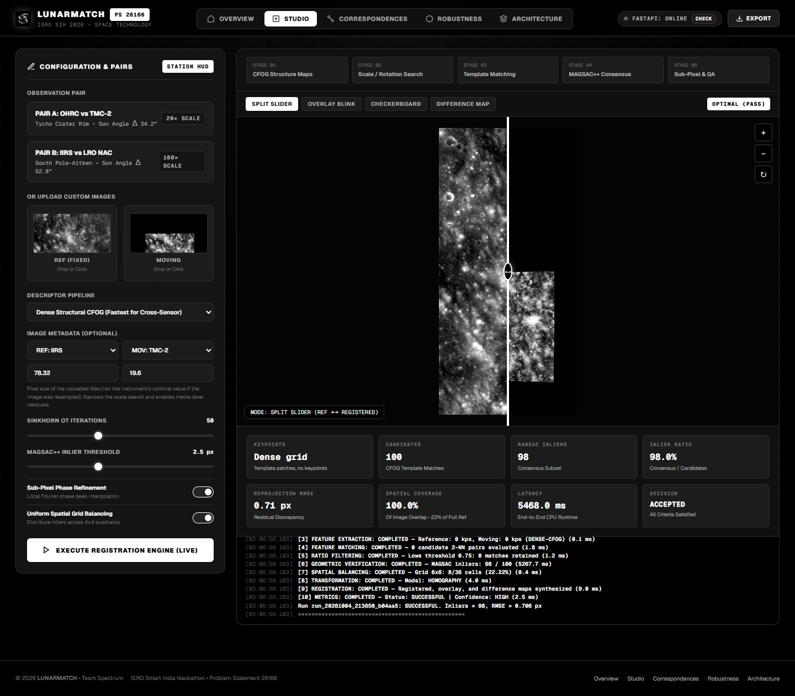
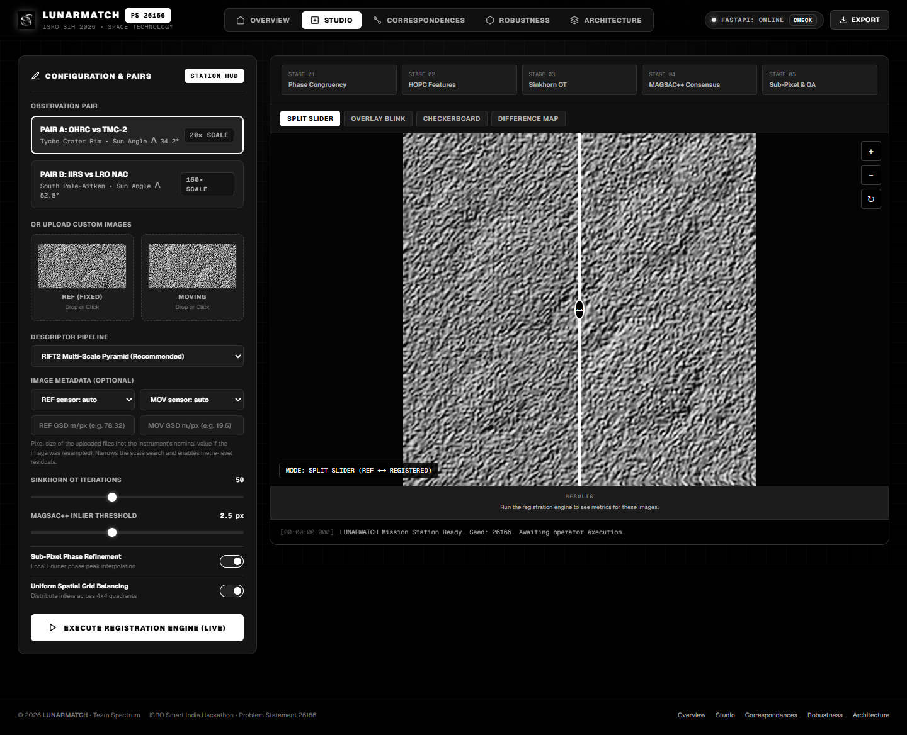
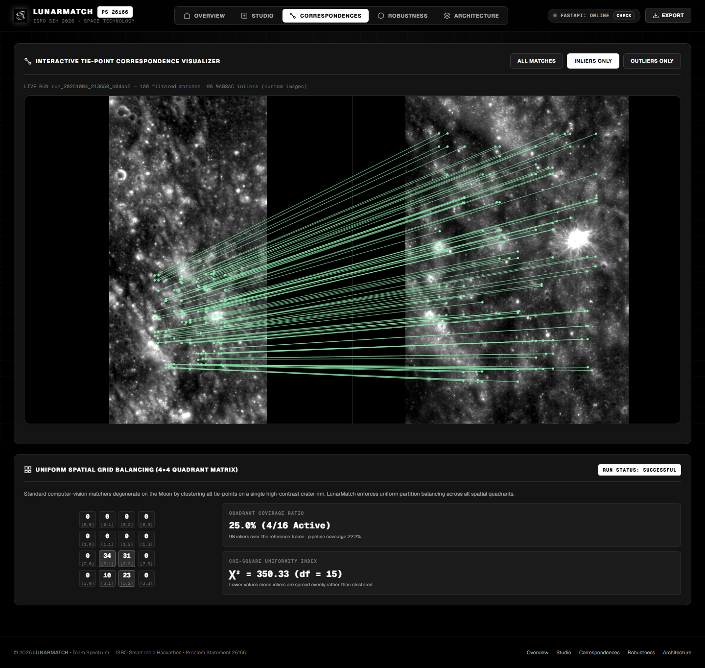
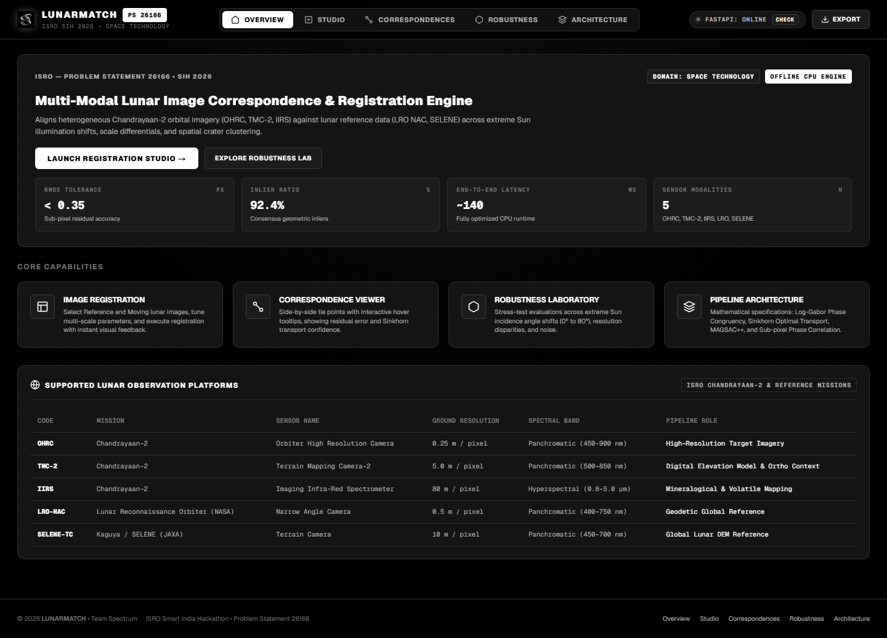
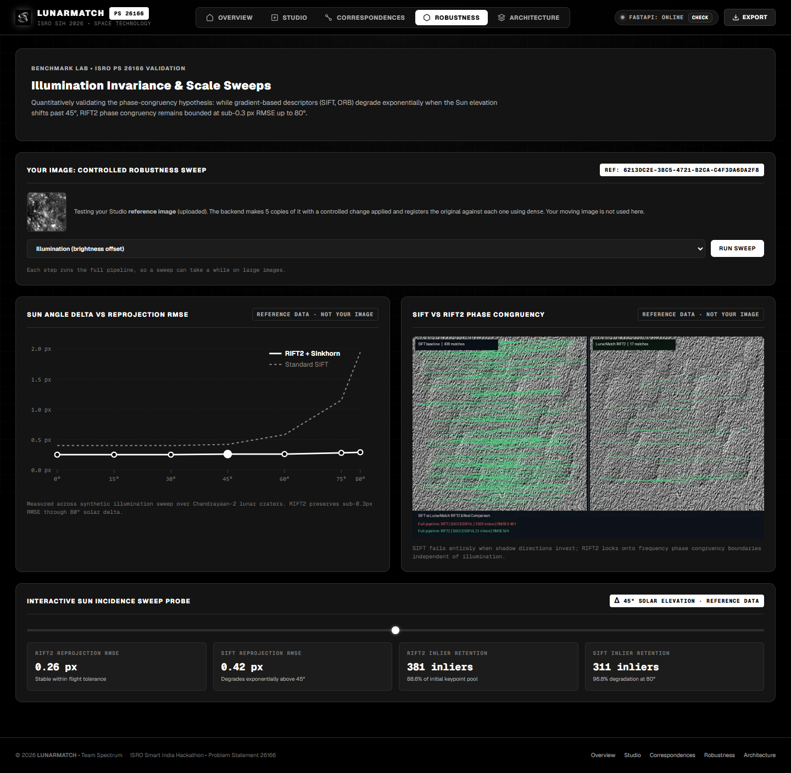

<div align="center">
  

  # LunarMatch

  **Multi-Modal Lunar Image Correspondence & Registration Engine**

  *Where Chandrayaan sees, LunarMatch connects.*

  [](https://sih.gov.in)
  [](https://sih.gov.in)
  [](https://spectrum-gules.vercel.app/)

  

  <sub>Web Studio: a real Chandrayaan-2 TMC-2 crop (19.6 m) registered onto IIRS (78.32 m) with the dense structural matcher.</sub>
</div>

---

## Overview

LunarMatch registers lunar orbital images taken by different sensors, at different
resolutions and under different Sun angles — Chandrayaan-2 OHRC, TMC-2 and IIRS,
and reference data such as LRO NAC and SELENE (Kaguya) TC. It finds
correspondences, estimates the transform, warps the moving image into the
reference frame, and reports measured quality metrics with an explicit accept /
reject decision.

It has three parts:

| Part | What it is |
| :--- | :--- |
| **Backend** (`backend/`) | FastAPI service running the registration pipeline on CPU (Python, OpenCV, NumPy, PyTorch for the optional learned matchers). |
| **Web app** (`web/`) | Next.js app with five tabs: Overview, Studio, Correspondences, Robustness, Architecture. |
| **Mobile app** (`mobile/`) | Flutter app (Android / Windows / web) with 13 screens and an offline demo mode. |

## Capabilities

**Feature extraction and matching**
- **RIFT2** phase-congruency features (216-D descriptors), single- and multi-scale — the default method
- **SIFT** baseline, **HOPC** structural descriptors, RIFT2 + SIFT fusion
- **SuperPoint**, **SuperGlue** and **LightGlue** (PyTorch, CPU, pretrained weights); each falls back to RIFT2 when its weights are missing
- **Dense structural registration (CFOG)** — area-based matching on oriented-gradient channels for cross-sensor pairs where sparse descriptors fail; runs on request or automatically as a fallback
- Brute-force or FLANN matching with Lowe's ratio test, self-calibrating SCDF gates, Hyp-Net descriptor modulation

**Geometry and refinement**
- **MAGSAC++** (default) or RANSAC, homography or affine
- Uniform spatial grid balancing (6 × 6 by default)
- Thin-plate-spline residual correction and phase-correlation sub-pixel refinement

**Lunar-specific handling**
- **Native Chandrayaan-2 PDS4 ingestion** — reads ISRO ISDA labels (GSD, Sun angles, corner coordinates) and memory-maps raw OHRC / TMC-2 `.img` and IIRS `.qub` cubes
- Lunar polar-stereographic reprojection and GSD normalisation for georeferenced rasters
- SPICE footprint and illumination checks (SpiceyPy with synthesized kernels), shadow masking, radiometric normalisation, cosine terrain correction
- Sensor-pair routing (OHRC / TMC-2 / IIRS / LRO NAC / SELENE)

**Quality control**
- Input gate that separates map-projection padding from real data gaps
- Per-criterion acceptance checklist that accounts for resolution differences and partial overlap
- `NOT_RELIABLE` instead of a wrong transform, with the failed criteria spelled out

## Screenshots

| Studio — before a run | Correspondences — inliers green, outliers red |
| :---: | :---: |
|  |  |
| **Overview** | **Robustness** |
|  |  |

More in [docs/WebApp.md](docs/WebApp.md). Mobile screens are described in [docs/MobileApp.md](docs/MobileApp.md).

## Quick Start

### 1. Backend

```bash
cd backend
python -m venv .venv
.venv\Scripts\activate            # Windows   (Linux/macOS: source .venv/bin/activate)
pip install -r requirements.txt
python scripts/download_weights.py   # optional: SuperPoint / SuperGlue / LightGlue weights (~96 MB)
uvicorn app.main:app --host 0.0.0.0 --port 8000
```

Interactive API docs: `http://127.0.0.1:8000/docs`. Endpoint reference: [docs/API.md](docs/API.md).

### 2. Web app

```bash
cd web
npm install        # first time only
npm run dev        # http://localhost:3000
```

The app calls the backend at `http://127.0.0.1:8000` (override with
`NEXT_PUBLIC_API_URL`). When the backend is unreachable the header shows
**FLIGHT SIMULATION** and the Studio runs an offline simulation with sample values.

### 3. Mobile app

```bash
cd mobile
flutter pub get                # requires Flutter 3.41+ (Dart 3.11)
flutter run -d windows         # or: flutter run -d chrome / an Android device
flutter build apk --release    # mobile/build/app/outputs/flutter-apk/app-release.apk
```

The Android emulator reaches the backend at `http://10.0.2.2:8000`; set another
URL (e.g. your PC's LAN address for a physical phone) on the **About** screen.

## Real Chandrayaan-2 Data

Raw ISSDC products go in the repository root as delivered — `tmc/`, `iir/`,
`ohr/` (git-ignored, multi-GB). From the same-orbit TMC-2 and IIRS strips,
`backend/validation/ch2_data.py` builds co-located validation pairs in
`backend/data/real/pairs/ch2_tmc_iirs_*`:

```bash
cd backend
python validation/ch2_data.py
```

Measured on six TMC-2 (19.6 m) → IIRS (78.32 m) pairs spanning 900 km of strip:

| Configuration | Registered | Mean time | Error (median) |
| :--- | :--- | :--- | :--- |
| RIFT2, no metadata | 6/6 | 34.9 s | 1.36 IIRS px |
| Dense CFOG + sensors/GSD | 6/6 | 6.8 s | 1.36 IIRS px (≈ 107 m) |

Unrelated image pairs are rejected as `NOT_RELIABLE`. Registration also exposed a
consistent ~8 km along-track disagreement between the TMC-2 and IIRS label
geolocation. Details: [docs/RealData.md](docs/RealData.md).

## Documentation

| Document | Contents |
| :--- | :--- |
| [Architecture](docs/Architecture.md) | System components, the full pipeline stage by stage, execution modes, artifacts |
| [API](docs/API.md) | Every endpoint, request fields, responses |
| [Metrics](docs/Metrics.md) | Metric definitions, status and confidence rules, acceptance checklist |
| [Web app](docs/WebApp.md) | Tab-by-tab guide with screenshots |
| [Mobile app](docs/MobileApp.md) | Screen-by-screen guide |
| [Real data](docs/RealData.md) | Chandrayaan-2 PDS4 ingestion, validation pairs, results |
| [Experiments](docs/Experiments.md) | Robustness sweeps and real-data validation |
| [Simulation](docs/Simulation.md) | Seeded simulation and offline demo modes |
| [Implementation status](docs/ImplementationStatus.md) | What is implemented and how it is verified |
| [Design](docs/Design.md) | Visual design system shared by web and mobile |
| [Demo guide](docs/DemoGuide.md) · [Jury guide](docs/JuryPresentationGuide.md) | Presentation scripts |

## Technology Stack

| Layer | Technology |
| :--- | :--- |
| Backend | Python 3.11+, FastAPI, OpenCV, NumPy, SciPy, scikit-image, rasterio, pyproj, SpiceyPy, PyTorch (CPU) |
| Web | Next.js 16, React 19, TypeScript |
| Mobile | Flutter 3.41, Provider, fl_chart |
| Algorithms | RIFT2, HOPC, Dense CFOG, SuperPoint, SuperGlue, LightGlue, MAGSAC++, TPS, phase correlation |
| Data | Chandrayaan-2 PDS4 (OHRC, TMC-2, IIRS) via ISSDC; LRO NAC and SELENE TC references |
| Tests | Pytest (isolated runner), Flutter Test |

## Project Structure

```
backend/
  app/api/          REST routes
  app/services/     pipeline orchestration and lunar-specific stages
  app/vision/       feature extractors, matchers, dense CFOG, geometry, metrics
  app/io/           PDS4 and GeoTIFF readers
  app/evaluation/   acceptance checklist, run manifest
  validation/       real-data pair builders and validation runners
  scripts/          weight download, benchmarks, report generation
  tests/            50 pytest files
web/                Next.js web app
mobile/             Flutter app (13 screens)
docs/               documentation, screenshots, visuals, JSON schemas
tmc/ iir/ ohr/      raw Chandrayaan-2 PDS4 products (local only, git-ignored)
```

## Testing

```bash
cd backend
python run_tests_isolated.py   # 50 test files, one process each

cd ../mobile
flutter test
```

Two tests assert wall-clock budgets (`test_canary.py`: CRS stage < 400 ms;
`test_finale_run.py`: < 35 s) and can fail on a heavily loaded machine. The
learned-matcher tests need the weights from `scripts/download_weights.py`.

## Attribution

LunarMatch builds on the following published work:

- RIFT2 — Li, Hu, Ai (IEEE TIP 2020 / arXiv 2023)
- HOPC — Ye et al. (IEEE TGRS 2017)
- CFOG — Ye et al., "Fast and robust matching for multimodal remote sensing images" (IEEE TGRS 2019)
- MAGSAC++ — Barath et al. (CVPR 2020)
- SuperPoint — DeTone, Malisiewicz, Rabinovich (CVPRW 2018)
- SuperGlue — Sarlin et al. (CVPR 2020); pretrained weights from magicleap/SuperGluePretrainedNetwork (research-only licence)
- LightGlue — Lindenberger, Sarlin, Pollefeys (ICCV 2023); weights from cvg/LightGlue (Apache-2.0)

## Team

Team Spectrum — Smart India Hackathon 2026
Problem Statement 26166 — Space Technology
Department of Space / ISRO

## License

Developed for ISRO Smart India Hackathon 2026.
