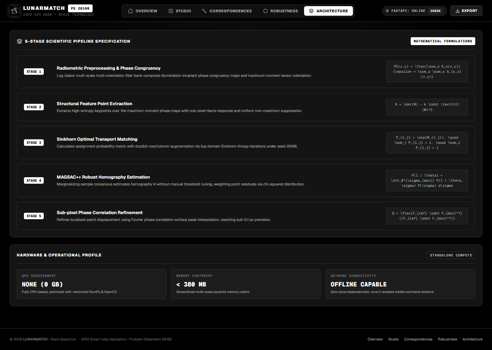
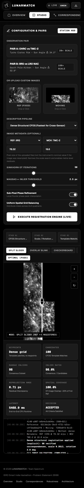

# LunarMatch — Web App

Next.js 16 / React 19 app in `web/`. Run it with `npm run dev`
(http://localhost:3000); it calls the backend at `http://127.0.0.1:8000`, or
`NEXT_PUBLIC_API_URL` if set.

Screenshots below were captured from the running app at 1440 px width with the
backend online. The Studio result uses the real Chandrayaan-2 pair
`backend/data/real/pairs/ch2_tmc_iirs_3` (see [RealData.md](RealData.md)).

---

## Header

- **Tabs:** Overview, Studio, Correspondences, Robustness, Architecture. Each tab
  has its own URL hash (`#studio`, `#correspondence`, …), so links and the
  browser back button work.
- **Backend status:** `FASTAPI: ONLINE` when `GET /health` answers, otherwise
  `FLIGHT SIMULATION`. **CHECK** probes again.
- **EXPORT:** downloads a JSON telemetry package or a tie-point CSV. These
  exports contain the bundled **sample data** (preset Pair A), not your runs.
  Per-run data is in `backend/outputs/run_<id>/` and the results API.

---

## Overview

Project summary, links into the Studio and Robustness tabs, four headline tiles,
the core capabilities and a table of supported sensors (OHRC, TMC-2, IIRS,
LRO NAC, SELENE TC). The headline tiles (RMSE tolerance, inlier ratio, latency)
are fixed illustrative figures, not measured from your runs.

---

## Studio

Where registrations are run.

**Left panel — configuration**
- **Observation pair:** two bundled demo pairs (synthetic prototypes), or upload
  your own reference and moving images (PNG / JPG / TIFF / BMP).
- **Descriptor pipeline:** RIFT2 Multi-Scale Pyramid (default), RIFT2
  Single-Scale, **Dense Structural CFOG** (fastest for cross-sensor pairs), HOPC,
  SIFT.
- **Image metadata (optional):** reference and moving sensor (OHRC, TMC-2, IIRS,
  LRO NAC, SELENE, Other) and GSD in m/px. Enter the pixel size of the
  **uploaded file** — e.g. 19.6 for a TMC-2 crop decimated 4× from 4.9 m. This
  narrows the scale search, sets the expected scale for the quality checklist
  and enables metre residuals.
- **MAGSAC++ inlier threshold**, **Sub-pixel refinement** and **Spatial grid
  balancing** are sent with the run. The **Sinkhorn OT iterations** slider is
  display-only and is not sent to the backend.
- **EXECUTE REGISTRATION ENGINE (LIVE)** runs the pipeline (SIMULATED when the
  backend is offline). The page scrolls to the log while it runs and to the
  results when it finishes. Runs may take minutes on large images; the page
  waits up to 10 minutes.

**Right panel — viewer and results**
- **Stage bar:** follows the method — the sparse path (Phase Congruency → HOPC →
  Sinkhorn OT → MAGSAC++ → Sub-Pixel & QA), the dense path (CFOG Structure Maps →
  Scale / Rotation Search → Template Matching → MAGSAC++ → Sub-Pixel & QA), or the
  fallback path when sparse matching failed and dense took over.
- **Viewer:** Split slider, Overlay blink, Checkerboard, Difference map, with
  zoom. After a successful run the moving side shows the registered image.
- **Metric cards** appear only after a run on the current images: keypoints
  ("Dense grid" for dense runs), candidates, RANSAC inliers, inlier ratio,
  reprojection RMSE, spatial coverage (within the image overlap when the backend
  reports it, plus the whole-reference figure), latency, decision. The
  OPTIMAL (PASS) / FAIL-SAFE badge appears with them.
- **Log:** every stage with its duration, the dense-registration note when it
  applies, and the final status.

*Dense CFOG run on a real TMC-2 → IIRS pair: 98 / 100 verified correspondences,
RMSE 0.71 px, 100 % coverage of the image overlap, ACCEPTED in 5.5 s.*

---

## Correspondences

- Side-by-side reference and moving images with match lines: **inliers in light
  green (solid), outliers in light red (dashed)**. Filters: All matches /
  Inliers only / Outliers only. Hover a point for its coordinates, residual and
  status.
- **Uniform spatial grid balancing:** inlier counts on a 4 × 4 partition of the
  reference frame, the fraction of active cells and a χ² uniformity index (lower
  = more even). This 4 × 4 view is computed in the browser; the backend's own
  balancing and coverage use a 6 × 6 grid.
- Uses the latest Studio run. Before any run it shows bundled demo data, labelled
  as such.

---

## Robustness

- **Your image: controlled robustness sweep** (live): takes the Studio reference
  image, makes 5 copies with a controlled change — illumination (brightness
  offset), scale (0.5× – 1.5×), rotation (±50°) or translation (±50 px) — and
  registers the original against each with the Studio's method
  (`POST /api/v1/experiments/robustness`). Needs a Studio run and the backend.
- **Sun angle delta vs reprojection RMSE**, **SIFT vs RIFT2 phase congruency**
  and the **sun incidence probe** show bundled reference data and are labelled
  *Reference data · not your image*.

---

## Architecture

A five-stage overview of the sparse method (phase congruency, keypoints, Sinkhorn
matching, MAGSAC++, sub-pixel refinement) with formulas, and the hardware profile
(CPU only, offline capable). It is a conceptual summary; the full pipeline,
including dense CFOG registration and the lunar-specific stages, is documented in
[Architecture.md](Architecture.md).

---

## Phone layout

The app is responsive; at phone width the Studio stacks configuration, viewer,
metric cards and log.
