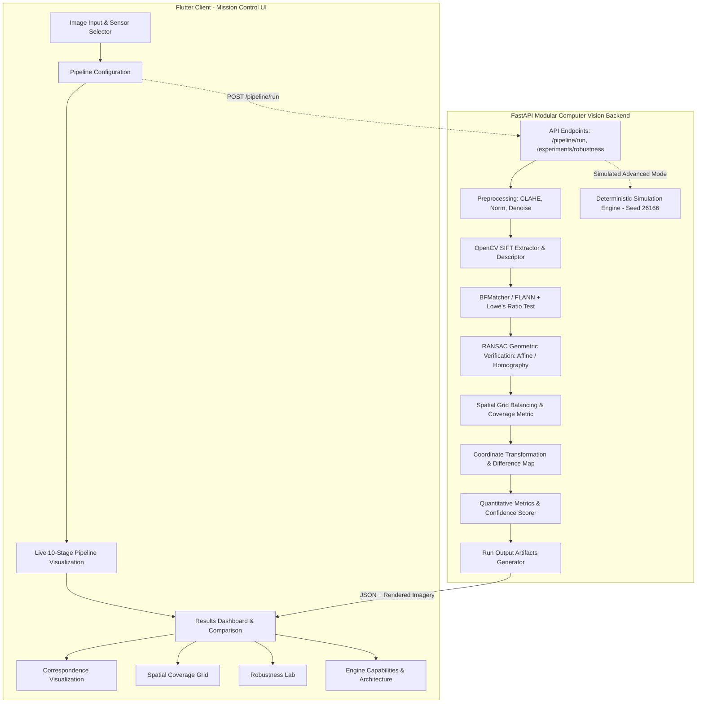

# Implementation Plan: LUNARMATCH Prototype

Multi-Modal Lunar Image Correspondence & Registration
Target: Smart India Hackathon 2026 | Problem Statement: 26166 | Organization: ISRO | Team: Spectrum | Domain: Space Technology

---

## 1. Executive Summary & Architecture Overview

LUNARMATCH is an end-to-end, scientifically honest, presentation-ready demonstrable prototype addressing the challenges of multi-modal lunar surface image correspondence and registration (such as aligning Chandrayaan-2 OHRC high-resolution optical imagery with TMC-2 stereo or IIRS hyperspectral datasets under varying illumination, scale, and sensor geometry).

The solution adheres strictly to the non-negotiable engineering principles:
- **No False Scientific Claims:** Clearly delineate `IMPLEMENTED` components (OpenCV SIFT, BFMatcher/FLANN, Lowe's Ratio Test, RANSAC Homography/Affine, Spatial Grid Balancing, Reprojection RMSE) from `SIMULATED` (deterministic simulation of RIFT/SuperPoint for demonstration) and `PLANNED` (LightGlue, RANSAC++, Sub-pixel refinement).
- **No Hard-Coded Metrics:** Every metric is computed directly from vision pipeline execution or deterministic, mathematically coherent simulation (using fixed seed `26166`).
- **Strict Terminology:** Fixed = *Reference Image*; Transformed = *Moving Image*.
- **Fail-Safe Mechanism:** If matches or inlier ratios fall below reliable thresholds, declare `REGISTRATION NOT RELIABLE` with precise diagnostics rather than showing an unstable or distorted warp.
- **Offline-First & Presentation Resilient:** Includes bundled lunar demo pairs (Demo Pair A and Demo Pair B) and a Local Demo Mode for zero-network environments.



---

## 2. Proposed Changes & Component Details

### A. Repository Structure (`c:/sih`)
```
c:/sih/
├── backend/
│   ├── app/
│   │   ├── main.py
│   │   ├── config.py
│   │   ├── api/
│   │   │   ├── __init__.py
│   │   │   ├── routes_health.py
│   │   │   ├── routes_images.py
│   │   │   ├── routes_pipeline.py
│   │   │   ├── routes_experiments.py
│   │   │   └── routes_results.py
│   │   ├── models/
│   │   │   ├── __init__.py
│   │   │   ├── requests.py
│   │   │   ├── responses.py
│   │   │   └── schemas.py
│   │   ├── services/
│   │   │   ├── __init__.py
│   │   │   ├── pipeline_service.py
│   │   │   ├── image_service.py
│   │   │   ├── simulation_service.py
│   │   │   ├── metrics_service.py
│   │   │   └── experiment_service.py
│   │   ├── vision/
│   │   │   ├── __init__.py
│   │   │   ├── extractor.py
│   │   │   ├── sift_extractor.py
│   │   │   ├── matcher.py
│   │   │   ├── geometry.py
│   │   │   ├── spatial.py
│   │   │   ├── registration.py
│   │   │   ├── preprocessing.py
│   │   │   ├── refinement.py
│   │   │   └── metrics.py
│   │   ├── simulation/
│   │   │   ├── __init__.py
│   │   │   ├── simulator.py
│   │   │   ├── scenario_generator.py
│   │   │   └── deterministic_results.py
│   │   └── utils/
│   │       ├── __init__.py
│   │       ├── image_utils.py
│   │       ├── file_utils.py
│   │       └── logging.py
│   ├── data/
│   │   ├── raw/
│   │   ├── processed/
│   │   └── examples/
│   │       ├── pair_a_ref.png
│   │       ├── pair_a_mov.png
│   │       ├── pair_b_ref.png
│   │       └── pair_b_mov.png
│   ├── outputs/
│   ├── experiments/
│   ├── tests/
│   │   ├── test_health.py
│   │   ├── test_preprocessing.py
│   │   ├── test_sift.py
│   │   ├── test_matching.py
│   │   ├── test_spatial_balancing.py
│   │   ├── test_metrics.py
│   │   ├── test_simulation.py
│   │   └── test_pipeline_api.py
│   ├── requirements.txt
│   ├── .env.example
│   └── README.md
├── mobile/
│   ├── pubspec.yaml
│   ├── assets/
│   │   └── demo/
│   │       ├── pair_a_ref.png
│   │       ├── pair_a_mov.png
│   │       ├── pair_b_ref.png
│   │       └── pair_b_mov.png
│   ├── lib/
│   │   ├── main.dart
│   │   ├── app/
│   │   │   ├── app.dart
│   │   │   ├── theme.dart
│   │   │   └── routes.dart
│   │   ├── models/
│   │   │   ├── image_model.dart
│   │   │   ├── pipeline_model.dart
│   │   │   ├── metrics_model.dart
│   │   │   ├── match_model.dart
│   │   │   ├── experiment_model.dart
│   │   │   └── result_model.dart
│   │   ├── services/
│   │   │   ├── api_service.dart
│   │   │   ├── image_service.dart
│   │   │   └── download_service.dart
│   │   ├── providers/
│   │   │   ├── pipeline_provider.dart
│   │   │   ├── image_provider.dart
│   │   │   └── experiment_provider.dart
│   │   ├── screens/
│   │   │   ├── splash_screen.dart
│   │   │   ├── home_screen.dart
│   │   │   ├── upload_screen.dart
│   │   │   ├── configure_screen.dart
│   │   │   ├── processing_screen.dart
│   │   │   ├── results_screen.dart
│   │   │   ├── correspondence_screen.dart
│   │   │   ├── spatial_coverage_screen.dart
│   │   │   ├── registration_screen.dart
│   │   │   ├── robustness_screen.dart
│   │   │   ├── status_screen.dart
│   │   │   ├── architecture_screen.dart
│   │   │   └── about_screen.dart
│   │   ├── widgets/
│   │   │   ├── lunar_image_card.dart
│   │   │   ├── metric_card.dart
│   │   │   ├── pipeline_step.dart
│   │   │   ├── match_visualization.dart
│   │   │   ├── spatial_grid_overlay.dart
│   │   │   ├── confidence_badge.dart
│   │   │   ├── status_badge.dart
│   │   │   ├── image_comparison.dart
│   │   │   └── section_header.dart
│   │   └── utils/
│   │       ├── constants.dart
│   │       ├── validators.dart
│   │       └── formatters.dart
│   └── test/
│       ├── unit_models_test.dart
│       └── widget_test.dart
├── docs/
│   ├── Architecture.md
│   ├── Design.md
│   ├── API.md
│   ├── Simulation.md
│   ├── Metrics.md
│   ├── Experiments.md
│   ├── ImplementationStatus.md
│   └── DemoGuide.md
├── .gitignore
└── README.md
```

---

### B. Backend Implementation Specifics
1. **Real Computer Vision Pipeline (`backend/app/vision/`)**:
   - `preprocessing.py`: Min-max normalization, Contrast Limited Adaptive Histogram Equalization (CLAHE) tailored for low-contrast lunar shadow zones, Gaussian/Bilateral denoising.
   - `sift_extractor.py`: Real OpenCV SIFT (`cv2.SIFT_create`) with configurable `nfeatures`, returning keypoint coordinates, octaves, orientations, and 128-dimensional descriptors.
   - `matcher.py`: Brute-Force (`cv2.BFMatcher(cv2.NORM_L2)`) or FLANN matcher with k-NN ($k=2$) and Lowe's ratio test filter (`ratio_threshold`, default 0.75).
   - `geometry.py`: RANSAC estimation for Homography (`cv2.findHomography` with `cv2.RANSAC`) or Affine (`cv2.estimateAffine2D` with `cv2.RANSAC`). Rejection of collinear or ill-conditioned transforms.
   - `spatial.py`: Grid-based spatial balancing. Divides the reference image into $N \times N$ cells (e.g., $4\times 4, 6\times 6, 8\times 8$). Sorts matches per cell by descriptor distance / confidence, retains top-$K$ matches per cell to eliminate spatial clustering on crater rims, and computes spatial coverage percentages before and after balancing:
     $$\text{Spatial Coverage} = \frac{\text{Occupied Grid Cells}}{\text{Total Grid Cells}} \times 100\%$$
   - `registration.py`: Warps the moving image into reference coordinates via `cv2.warpPerspective` or `cv2.warpAffine`. Synthesizes alpha overlays (blending 0-100%) and normalized absolute difference maps (`|I_{ref} - I_{warped}|`).
   - `metrics.py`: Computes keypoint counts, candidate matches, filtered matches, RANSAC inliers, inlier ratio ($N_{inliers} / N_{filtered}$), spatial coverage before and after, reprojection Root Mean Square Error (RMSE) on inliers:
     $$\text{RMSE} = \sqrt{\frac{1}{M} \sum_{i=1}^M \|\mathbf{x}_i^{ref} - H \mathbf{x}_i^{mov}\|^2}$$
     and derives a deterministic prototype confidence indicator (`HIGH`, `MEDIUM`, `LOW`, `REJECTED`) with explicit explanations.
   - `refinement.py`: Modular interface for Sub-pixel refinement (clearly annotated as Planned).

2. **Deterministic Simulation Engine (`backend/app/simulation/`)**:
   - For simulated modes (e.g. RIFT or SuperPoint simulation), uses fixed seed `26166`.
   - Incorporates realistic physics-inspired response curves:
     - As illumination difference increases, candidate match degradation increases non-linearly.
     - Scale differences reduce inlier count based on scale factor $|1 - s|$.
     - Produces reproducible keypoint sets, candidate matches, and inliers with accurate geometric relations.

3. **Artifact Persistence (`outputs/run_<id>/`)**:
   - Automatically writes the 13 required artifact files for auditability:
     `input_metadata.json`, `configuration.json`, `keypoints_reference.json`, `keypoints_moving.json`, `matches_candidate.json`, `matches_filtered.json`, `matches_inliers.json`, `matches_spatial.json`, `registered.png`, `overlay.png`, `difference.png`, `metrics.json`, `experiment_log.json`.

4. **API Endpoints**:
   - `GET /health`
   - `POST /api/v1/images/upload`
   - `GET /api/v1/images/demo/{pair_id}` (returns Demo Pair A or B metadata & paths)
   - `POST /api/v1/pipeline/run` (executes baseline or simulation pipeline, returns run_id, stages, metrics, output paths)
   - `GET /api/v1/results/{run_id}`
   - `GET /api/v1/results/{run_id}/artifact/{filename}` (serves registered images, overlays, diffs)
   - `POST /api/v1/experiments/robustness` (runs synthetic illumination, scale, rotation, translation sweep, returns comparative metrics & curves)

---

### C. Frontend Implementation Specifics (Flutter)
1. **Design System & Theme**:
   - Dark Space Tech / Mission Control aesthetic.
   - Deep cosmic dark background (`#0A0E17`), surface card dark blue-grey (`#111827`, `#1A2234`), border slate (`#2D3748`).
   - Accent cyan (`#00E5FF`), orbit blue (`#38BDF8`), success emerald (`#10B981`), warning amber (`#F59E0B`), danger coral (`#EF4444`).
   - Monospace typography for numeric data and technical coordinates.

2. **Screens**:
   - **Splash Screen**: Animated orbital radar / grid styling with ISRO, SIH 2026, PS 26166, Team Spectrum branding.
   - **Home Screen**: Mission control dashboard with Engine Status (`ONLINE` / `LOCAL DEMO`), quick action cards (Registration, Robustness Lab, Previous Experiments, Architecture), recent telemetry snippet.
   - **Image Input Screen**: Two distinct cards: `REFERENCE IMAGE` (Fixed Coordinate System) and `MOVING IMAGE` (To Transform). Dropdown for lunar sensors (OHRC, TMC, TMC-2, IIRS, LRO NAC, SELENE, Other). Upload button + "Load Demo Pair" button. Image dimension/format validation and non-destructive "Swap" button with proper terminology preservation.
   - **Configuration Screen**: Selection of Method (SIFT Baseline [IMPLEMENTED] vs RIFT [SIMULATED] vs SuperPoint [SIMULATED]), Matcher (BFMatcher, FLANN), Preprocessing toggles (CLAHE, Normalization, Denoising), Spatial Balancing toggle ($4\times4, 6\times6, 8\times8$), Geometric Model (Homography / Affine), RANSAC threshold sliders, Reset Defaults.
   - **Processing Screen**: 10-step animated pipeline tracker (Validation -> Preprocessing -> Feature Extraction -> Feature Matching -> Ratio Filtering -> Geometric Verification -> Spatial Balancing -> Transformation -> Registration -> Metrics). Step-by-step state animations (Waiting -> Processing -> Completed/Failed) and elapsed timer.
   - **Results Screen**: High-impact registration visualizer:
     - Prominent status badge (`REGISTRATION SUCCESSFUL` or `REGISTRATION NOT RELIABLE`).
     - Interactive view with 4 modes: `REFERENCE`, `REGISTERED`, `OVERLAY` (with 0-100% opacity slider), `DIFFERENCE`.
     - Full pan/zoom interactive viewer (`InteractiveViewer`).
     - Quick metrics strip and expandable transformation matrix details.
   - **Metrics Dashboard**: Clear, honest card grid: Keypoints (Ref/Mov), Candidate Matches, Filtered Matches, RANSAC Inliers, Inlier Ratio (%), Spatial Coverage (%), Reprojection RMSE (px), Runtime (ms), and Prototype Confidence Level (`HIGH` / `MEDIUM` / `LOW`).
   - **Correspondence Visualization Screen**: Custom canvas drawing matching lines connecting Reference and Moving images. 4 toggleable tabs: `CANDIDATES`, `FILTERED`, `RANSAC INLIERS`, `SPATIAL BALANCED`. Count indicators and interactive pan/zoom.
   - **Spatial Coverage Screen**: Visual grid overlay on the reference image displaying cells before vs after spatial balancing, occupied cell counts, and coverage percentage improvement.
   - **Robustness Lab Screen**: Interactive synthetic experiment studio: controls for illumination delta, scale factor, rotation angle, translation offset. Live graph showing Inlier Ratio vs Variation and Spatial Coverage vs Variation. Clear disclaimer: `CONTROLLED SYNTHETIC EXPERIMENT`.
   - **Engine Capabilities & Architecture Screen**: Credibility matrix showing `IMPLEMENTED` vs `SIMULATED` vs `PLANNED` components, plus interactive diagram contrasting Current MVP with Target Research Architecture.
   - **About Screen**: Mission statement, problem context, team info.

3. **Offline / Local Demo Mode**:
   - App includes Demo Pair A and Demo Pair B in assets.
   - If FastAPI backend is unreachable or user toggles `Demo Mode`, the app runs local deterministic processing without crashing or displaying network errors, with an explicit `LOCAL DEMO` indicator.

---

## 3. Verification Plan

### Automated Backend Tests
- `pytest backend/tests/test_health.py`: Verifies `/health` endpoint status.
- `pytest backend/tests/test_preprocessing.py`: Tests normalization, CLAHE, and denoising routines on sample arrays.
- `pytest backend/tests/test_sift.py`: Tests SIFT feature detection and descriptor generation.
- `pytest backend/tests/test_matching.py`: Tests BFMatcher and FLANN with Lowe's ratio test.
- `pytest backend/tests/test_spatial_balancing.py`: Tests grid partitioning, cell selection, and coverage ratio calculations.
- `pytest backend/tests/test_metrics.py`: Validates RMSE computation and confidence score assignment.
- `pytest backend/tests/test_simulation.py`: Tests seed determinism (seed 26166 producing identical outputs across runs).
- `pytest backend/tests/test_pipeline_api.py`: End-to-end API testing of `/api/v1/pipeline/run` with mock and demo image inputs.

### Automated Frontend Tests
- `flutter test`: Runs Dart unit tests for model deserialization, provider state transitions, and widget rendering.

### Manual & End-to-End Verification
1. Start FastAPI server (`uvicorn backend.app.main:app --port 8000`).
2. Run Flutter app on Windows (`flutter run -d windows`) or Chrome.
3. Test Demo Pair A end-to-end flow:
   - Select Demo Pair A (OHRC vs TMC-2).
   - Verify Sensor labels and terminology.
   - Configure SIFT Baseline with CLAHE and 6x6 spatial balancing.
   - Execute pipeline -> observe 10-stage animated progress.
   - Verify Results dashboard: inspect Registered image, test Overlay slider (0-100%), inspect Difference map.
   - View Correspondence screen: toggle Candidates -> Filtered -> Inliers -> Spatially Balanced.
   - View Spatial Coverage screen: observe grid before vs after balancing.
   - Test Robustness Lab: adjust illumination/scale sliders, run experiment, view variation plots.
   - Inspect Engine Capabilities: verify honest status flags (`IMPLEMENTED`, `SIMULATED`, `PLANNED`).
   - Trigger fail-safe test (e.g. blank or mismatched synthetic pair) -> verify `REGISTRATION NOT RELIABLE` display with detailed diagnostic reasons.
4. Verify created artifacts in `backend/outputs/run_<id>/`.
